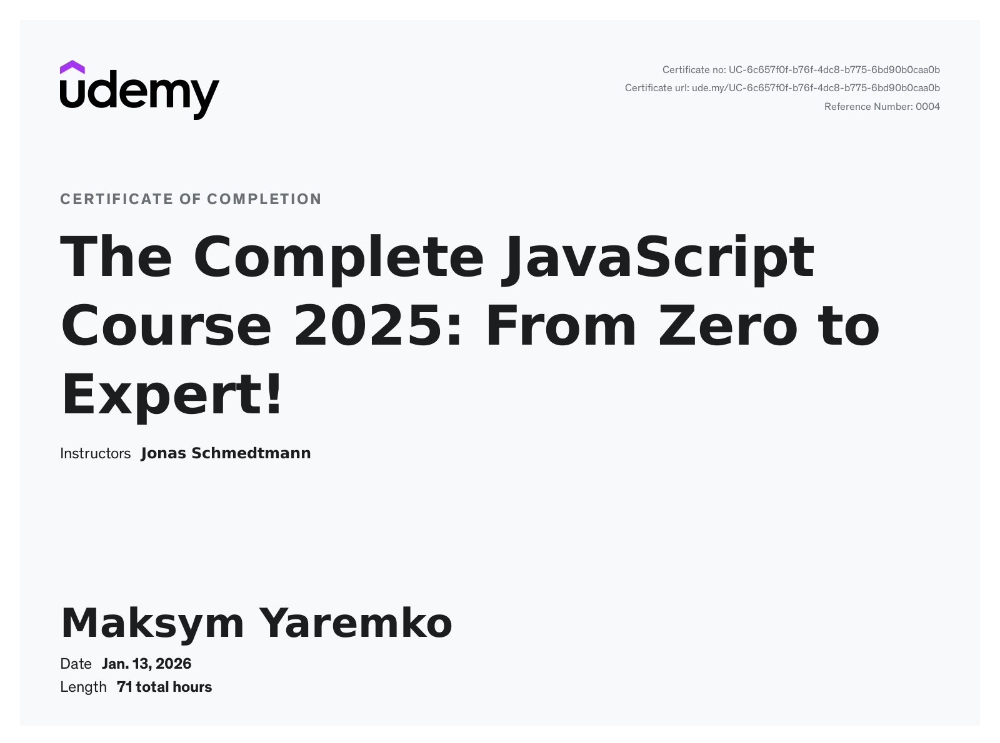

# JavaScript Learning & Practice Repository 🚀

This repository contains my JavaScript learning notes, code examples, and practice projects.
It documents my progress from JavaScript fundamentals to advanced concepts, modern syntax, and real-world applications.

I have fully completed the **Udemy course "The Complete JavaScript Course 2025: From Zero to Expert!" by Jonas Schmedtmann**, which this repository closely follows and expands upon with practice projects.
https://www.udemy.com/certificate/UC-6c657f0f-b76f-4dc8-b775-6bd90b0caa0b/

The goal of this repository is to build a strong JavaScript foundation, understand how JavaScript works behind the scenes, and apply concepts through hands-on projects.

---

## 📚 Topics Covered

### ✅ JavaScript Basics
- Variables & data types
- Arrays
- Decision making (`if/else`, `switch`, ternary)
- Object literals
- Loops (`for`, `while`, `for...of`, `forEach`)

---

### ✅ Modern JavaScript (ES6+)
- Destructuring (objects & arrays)
- Spread & rest operators
- Short-circuiting (`&&`, `||`, `??`)
- Optional chaining
- Sets
- Maps
- All major array methods:
  - `map`, `filter`, `reduce`
  - `find`, `some`, `every`
  - `sort`, `flat`, `flatMap`
  - `slice`, `splice`, `concat`

---

### ✅ Functions (In Depth)
- Default parameters
- Higher-order functions
- Closures
- `call`, `apply`, `bind`
- Callback functions
- First-class & pure functions

---

### ✅ Asynchronous JavaScript
- Call stack & event loop
- Web APIs
- Microtasks vs macrotasks
- Callbacks & callback hell
- Promises
- Async / Await
- Error handling (`try/catch`)
- Promise combinators:
  - `Promise.all`
  - `Promise.race`
  - `Promise.allSettled`
  - `Promise.any`

---

### ✅ Working with APIs
- Fetch API
- AJAX & JSON
- REST APIs
- Handling API errors
- Running promises in parallel
- Promisifying callback-based APIs

---

### ✅ Numbers & Dates
- Working with numbers
- Converting & parsing values
- Rounding
- Remainder operator
- BigInt
- Dates & time manipulation

---

### ✅ DOM & Browser APIs
- DOM selection & traversal
- Event handling
- Event delegation
- Advanced DOM manipulation
- Forms & `FormData` API
- Intersection Observer
- LocalStorage
- Keyboard events

---

### ✅ Object-Oriented Programming (OOP)
- Constructor functions and the `new` operator
- Prototypes and the prototype chain
- Prototypal inheritance
- Inheritance between “classes” (ES5 & ES6)
- Prototypal inheritance on built-in objects
- `Object.create()` pattern
- ES6 classes
- Instance properties and methods
- Getters and setters
- Public vs private fields (`_` convention and `#private`)
- Encapsulation
- Abstraction
- Polymorphism
- MVC architecture fundamentals
- Publisher–Subscriber (Observer) pattern

---

## 📁 Repository Structure
Each folder contains focused examples, experiments, or small projects related to the topic.

---

## 🎯 Goals

- Master JavaScript fundamentals and modern syntax
- Deeply understand asynchronous JavaScript
- Write clean, readable, and maintainable code
- Apply concepts to real-world scenarios
- Prepare for frontend and full-stack development roles

---

## 📝 Notes

This repository is primarily for learning and reference.
Some code may be experimental or simplified to focus on understanding specific concepts.

---

## 👤 Author

**Maksym Yaremko**  

Aspiring Web Developer  

